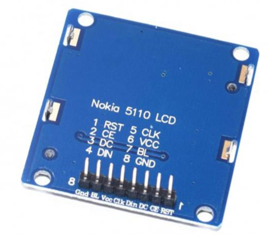
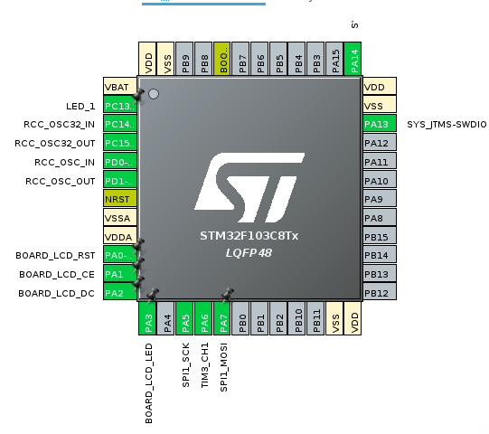
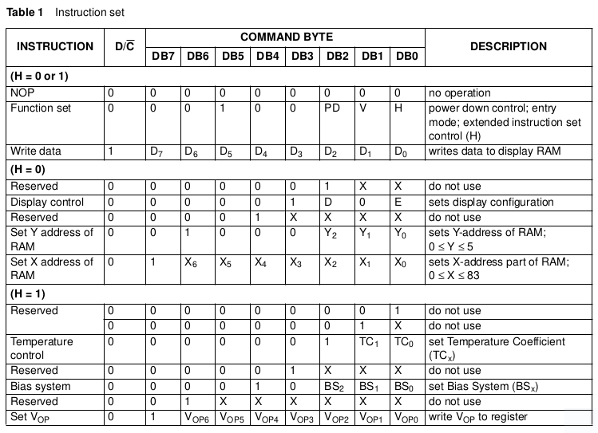
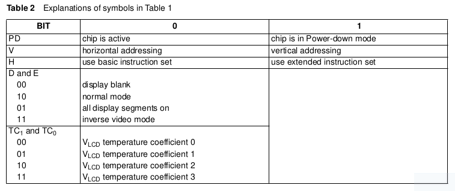

# STM32 Nokia-LCD5110

This library is used to control Nokia's 5110 LCD on STM32 devices. It was built on STM's HAL and intends to offer an 
easy and fast way to use 5110 using HAL's GPIOs. It's based on two other 5110 libraries:

## How to use this library?
This library was built to use with STM32 HAL for STM32 devices. It's recommended to use it with STM32CubeMX.

Steps to use this library:
* Configure the desired pins you want to use with the LCD as GPIOs on STM32CubeMX.
* Import this library into your generated project.
* Configure your pins using the library set functions:

| LCD  |         STM32 |
| :--- |--------------:| 
| RST  | BOARD_LCD_RST |
| CE   |  BOARD_LCD_CE |
| DC   |  BOARD_LCD_DC |
| DIN  |     SPI1_MOSI |
| CLK  |      SPI1_CLK |
| VCC  |           VCC |
| BL   | BOARD_LCD_LED |
| GND  |           GND |

~~~ c
#include <stdio.h>
#include <string.h>
#include "lcd_5110.h"

int main(void) {
   LCD_setRST(BOARD_LCD_RST_GPIO_Port, BOARD_LCD_RST_Pin);
   LCD_setCE(BOARD_LCD_CE_GPIO_Port, BOARD_LCD_CE_Pin);
   LCD_setDC(BOARD_LCD_DC_GPIO_Port, BOARD_LCD_DC_Pin);
   LCD_setLED(BOARD_LCD_LED_GPIO_Port, BOARD_LCD_LED_Pin);
   LCD_setSPI(&hspi1);
   LCD_Init();
   LCD_Led(LCD_LED_STATUS_ON);
   
   char bufLed[255] = {0};
   
   while(1){
        memset((char *)bufLed, 0, sizeof(bufLed));
        sprintf(bufLed, "Hello world");
        LCD_Write_String(0, 0, bufLed);

        LCD_setFONT(font_6x8_bold);
        sprintf(bufLed, "TEST");
        LCD_Write_String(0, 1, bufLed);
        
        HAL_Delay(5000);
   }
}
~~~

--------------------
Github: https://github.com/rootlocal/stm32-nokia_lcd_5110
